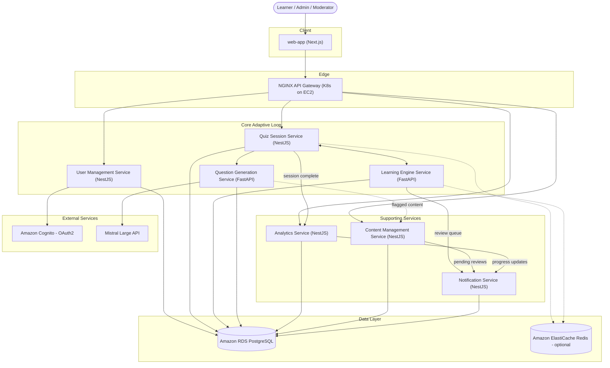

# 🧠 Microservice Mapping for Memosphere Engine

This document maps each step of the adaptive learning workflow to its corresponding microservice. The goal is to maintain modularity, clarity, and scalability without over-fragmenting the architecture.

## 📋 Microservice Overview

| Service Name                    | Description                                                                                                                                                      | Workflow Steps     |
| ------------------------------- | ---------------------------------------------------------------------------------------------------------------------------------------------------------------- | ------------------ |
| **User Management Service**     | Handles authentication, user profile setup, role assignment, and access control                                                                                  | Steps 1-2          |
| **Learning Engine Service**     | Applies BKT decay logic, updates mastery state, handles cognitive modeling, BKT initialization, Bloom-level mapping, model updates, and adaptive decision engine | Steps 3, 7, 10, 11 |
| **Quiz Session Service**        | Orchestrates session lifecycle, user input, delivers questions, logs responses, and tracks session stats                                                         | Steps 4-7, 9-10    |
| **Question Generation Service** | Generates questions using AI, assigns IRT metadata, and runs validation logic to ensure quality                                                                  | Step 8             |
| **Analytics Service**           | Finalizes session, computes performance metrics, declares mastery, and generates personalized feedback                                                           | Steps 12-13        |
| **Content Management Service**  | Provides tools for moderators and admins to review flagged questions and manage content quality                                                                  | Optional           |
| **Notification Service**        | Sends reminders for pending reviews, session nudges, and progress updates to learners                                                                            | Optional           |

---

## Architecture Diagram

Source: [`diagrams/microservice-overview.mmd`](diagrams/microservice-overview.mmd)

**Notes:**

- Gateway only exposes `User Management`, `Quiz Session`, `Analytics`, `Content Management` publicly. `Learning Engine` and `Question Generation` are internal-only, reached via `Quiz Session Service`.
- `migration-service` and the `shared` package are build-time/library concerns, not request-serving nodes, so they're excluded from this runtime diagram.

---

## Step 1–2: User Account Creation & Role Access

**Service:** User Management Service  
Handles authentication, user profile setup, role assignment, and access control.

---

## Step 3: Scheduled Decay Check on Login

**Service:** Learning Engine Service  
Applies BKT decay logic, updates mastery state, and populates the review queue based on spaced repetition needs.

---

## Step 4–7: Quiz Initialization, Thema Extraction, Concept Mapping, BKT Setup

**Services:**

- Quiz Session Service → Orchestrates session lifecycle and user input
- Learning Engine Service → Handles cognitive modeling, BKT initialization, and Bloom-level mapping

---

## Step 8: Question Generation & Validation

**Service:** Question Generation Service  
Generates questions using AI (Prompt 3), assigns IRT metadata, and runs validation logic to ensure quality.

---

## Step 9–10: Learner Interaction & Model Update

**Services:**

- Quiz Session Service → Delivers questions, logs responses, tracks session stats
- Learning Engine Service → Updates BKT (P(Ln)) and IRT (θ) based on learner performance

---

## Step 11: Adaptive Decision Engine

**Service:** Learning Engine Service  
Selects the next question using mastery signals, Bloom-level history, and spaced repetition logic.

---

## Step 12–13: Session Completion, Analytics, Mastery Declaration

**Service:** Analytics Service  
Finalizes session, computes performance metrics, declares mastery, and generates personalized feedback.

---

## Optional: Dashboards & Moderation

**Service:** Content Management Service  
Provides tools for moderators and admins to review flagged questions and manage content quality.

---

## Optional: Notifications & Reminders

**Service:** Notification Service  
Sends reminders for pending reviews, session nudges, and progress updates to learners.
