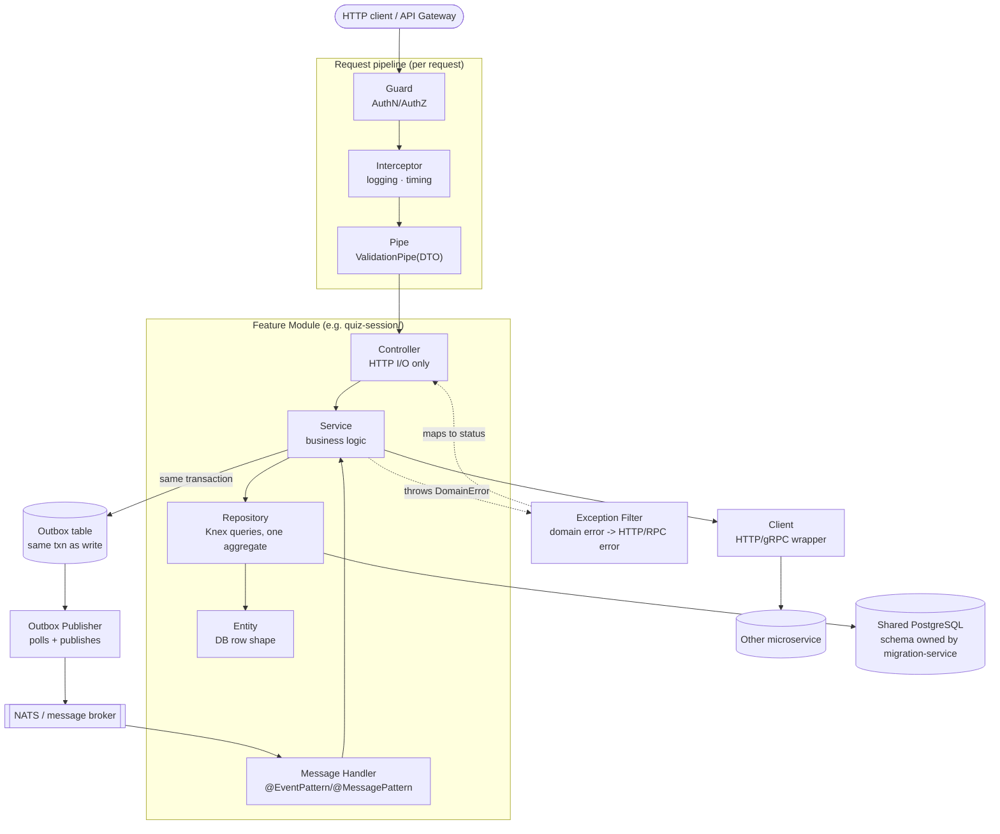
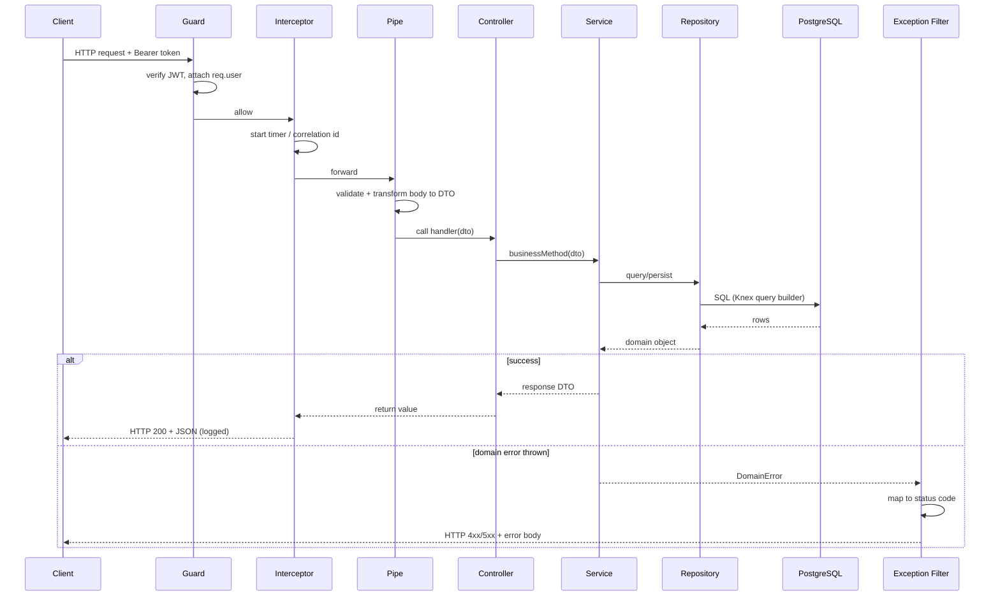
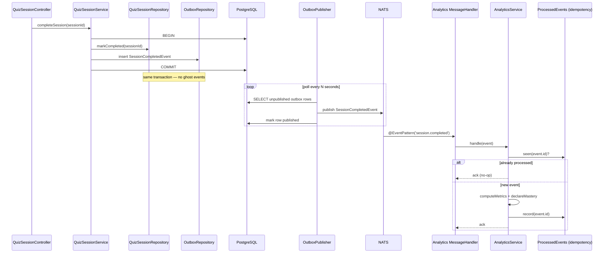

# NestJS Microservice Architecture

Reference architecture for all NestJS services in Memosphere (`user-management-service`, `quiz-session-service`, `analytics-service`, `content-management-service`, `notification-service`). Modular-monolith-per-service, DI-first, layered — built on **NestJS 11 + TypeScript + Knex** (the project's existing query builder — schema is owned centrally by `migration-service`, see [Migrations](#migrations)) **+ class-validator/class-transformer + `@nestjs/microservices`** for cross-service async events.

A NestJS service here is not "a controller with some services" — it is a set of **feature modules**, each a bounded context with an explicit public API (`exports`), composed by one root `AppModule`. This is what lets a service grow without becoming a ball of mud, and what lets a module be peeled off into its own deployable later without a rewrite.

## Layers

| Layer               | Responsibility                                                                                                                                                              | Depends on                 |
| ------------------- | --------------------------------------------------------------------------------------------------------------------------------------------------------------------------- | -------------------------- |
| **Module**          | Composition root for one bounded context. Wires controllers/handlers/providers, declares `exports` for the only things other modules may use.                               | Nothing (wires others)     |
| **Controller**      | HTTP I/O only: route, validate (DTO + Pipe), call service, return response DTO. No business logic, no SQL.                                                                  | Service (via DI)           |
| **Message Handler** | Same contract as Controller, for inbound async events/RPC (`@EventPattern` / `@MessagePattern`). No business logic.                                                         | Service (via DI)           |
| **DTO**             | `class-validator`/`class-transformer` classes — request/response shape (I/O). Never the persistence row.                                                                    | Nothing                    |
| **Service**         | Business logic / use cases. Orchestrates repositories, clients, and outbox writes.                                                                                          | Repository, Client, Outbox |
| **Repository**      | All DB access for one aggregate/table. Hides the Knex query builder from the service.                                                                                       | Knex connection            |
| **Entity**          | Plain TS class/interface describing a DB row (persistence shape, not I/O shape).                                                                                            | Nothing                    |
| **Client**          | Wraps one outbound call to another microservice or 3rd-party API (HTTP, gRPC, or `ClientProxy`). Hides transport/retry details, translates failures into domain exceptions. | Config                     |
| **Guard**           | AuthN/AuthZ — verifies the bearer token, attaches the principal to the request.                                                                                             | Nothing                    |
| **Interceptor**     | Cross-cutting concerns that wrap the whole handler: logging, timing, response shaping, caching.                                                                             | Nothing                    |
| **Pipe**            | Input validation/transformation (`ValidationPipe`, `ParseUUIDPipe`).                                                                                                        | DTO                        |
| **Filter**          | Maps domain exceptions to HTTP/RPC error responses.                                                                                                                         | Nothing                    |

**Rule:** DTOs (I/O) and persistence rows (Entity) are never the same class — same split as Pydantic schemas vs. SQLAlchemy models in the [FastAPI architecture](../python-fastapi/architecture.md). Controllers and Message Handlers never import a Repository or the Knex connection directly — only Services do, through DI.

A **Client** is this layer's async-transport analogue of a Repository: a Repository hides Knex behind domain methods, a Client hides an HTTP call/`ClientProxy` the same way — this is what makes calling `learning-engine-service` (FastAPI, different language) mockable in service-level tests and swappable without touching business logic.

## Folder Structure

```
src/<service-name>/
├── main.ts                          # bootstrap: HTTP + hybrid microservice transport, global pipes/filters
├── app.module.ts                    # root module — imports every feature module
├── config/
│   └── configuration.ts             # @nestjs/config + Joi-validated env schema
├── common/
│   ├── exceptions/
│   │   └── domain.exception.ts      # DomainError base + subclasses
│   ├── filters/
│   │   └── domain-exception.filter.ts
│   ├── interceptors/
│   │   └── logging.interceptor.ts
│   ├── guards/
│   │   └── jwt-auth.guard.ts
│   └── decorators/
│       └── current-user.decorator.ts
├── database/
│   └── knex.module.ts               # Knex connection provider (schema owned by migration-service)
├── modules/
│   └── quiz-session/
│       ├── dto/
│       │   ├── create-session.dto.ts
│       │   └── session-response.dto.ts
│       ├── entities/
│       │   └── quiz-session.entity.ts
│       ├── repositories/
│       │   └── quiz-session.repository.ts
│       ├── quiz-session.controller.ts
│       ├── quiz-session.service.ts
│       └── quiz-session.module.ts
├── clients/
│   └── learning-engine.client.ts    # outbound HTTP call to learning-engine-service (FastAPI)
└── outbox/
    ├── outbox.repository.ts
    ├── outbox-publisher.service.ts  # polls outbox, publishes to NATS
    └── outbox.module.ts             # registers the NATS ClientProxy + exports OutboxRepository
```

**Rule:** start with `modules/<feature>/` flat (DTO + entity + repository + service + controller + module). Add `outbox/` and a `Client` only once the module actually emits a cross-service event or calls another service — same "start simple" rule as the FastAPI doc.

## Infrastructure Prerequisite: Message Broker

`infrastructure/docker/docker-compose.yml` currently provisions Postgres and Redis only — no NATS/Kafka/RabbitMQ. The outbox pattern and `@EventPattern` consumers in this doc are **not runnable until a broker is added**. Adopting this architecture means adding a service like:

```yaml
# infrastructure/docker/docker-compose.yml
nats:
  image: nats:2-alpine
  container_name: memosphere-nats
  ports:
    - '4222:4222'
  networks:
    - memosphere-network
```

and wiring `NATS_URL=nats://nats:4222` into each NestJS service's environment. Until then, treat [Example 15](#15-outbox-publisher--module-outboxoutbox-publisherservicets-outboxoutboxmodulets) onward as the target, not the current state — same as the FastAPI doc's OpenTelemetry/`tenacity` sections describing conventions not yet wired into `question-generation-service`.

## Diagrams

Source files: [`diagrams/nestjs-architecture-overview.mmd`](diagrams/nestjs-architecture-overview.mmd) · [`diagrams/nestjs-request-pipeline.mmd`](diagrams/nestjs-request-pipeline.mmd) · [`diagrams/nestjs-event-driven-flow.mmd`](diagrams/nestjs-event-driven-flow.mmd)

### Module & request pipeline overview



### Request pipeline (sequence)



### Event-driven flow: outbox → broker → idempotent consumer



## Examples

All examples below build one vertical slice — `quiz-session-service` completing a session — plus the cross-service event it emits and `analytics-service` consuming it. This mirrors the real edge in [`microservice-overview.mmd`](../microservice/diagrams/microservice-overview.mmd): `QuizSession -- session complete --> Analytics`.

### 1. DTO (`modules/quiz-session/dto/create-session.dto.ts`)

```ts
import { ArrayMinSize, IsArray, IsString, IsUUID } from 'class-validator';

export class CreateSessionDto {
  @IsUUID()
  userId: string;

  @IsArray()
  @ArrayMinSize(1)
  @IsString({ each: true })
  themaIds: string[];
}

export class SessionResponseDto {
  id: string;
  userId: string;
  status: 'in_progress' | 'completed';
  createdAt: string;
}
```

### 2. Entity (`modules/quiz-session/entities/quiz-session.entity.ts`)

```ts
export interface QuizSessionRow {
  id: string;
  user_id: string;
  status: 'in_progress' | 'completed';
  created_at: Date;
  completed_at: Date | null;
}

export class QuizSession {
  constructor(
    readonly id: string,
    readonly userId: string,
    readonly status: 'in_progress' | 'completed',
    readonly createdAt: Date
  ) {}

  static fromRow(row: QuizSessionRow): QuizSession {
    return new QuizSession(row.id, row.user_id, row.status, row.created_at);
  }
}
```

### 3. Repository (`modules/quiz-session/repositories/quiz-session.repository.ts`)

```ts
import { Inject, Injectable } from '@nestjs/common';
import type { Knex } from 'knex';
import { KNEX_CONNECTION } from '../../../database/knex.module';
import { QuizSession, QuizSessionRow } from '../entities/quiz-session.entity';

@Injectable()
export class QuizSessionRepository {
  constructor(@Inject(KNEX_CONNECTION) private readonly knex: Knex) {}

  async create(userId: string): Promise<QuizSession> {
    const [row] = await this.knex<QuizSessionRow>('quiz_sessions')
      .insert({ user_id: userId, status: 'in_progress' })
      .returning('*');
    return QuizSession.fromRow(row);
  }

  async markCompleted(sessionId: string, trx: Knex.Transaction): Promise<void> {
    await trx<QuizSessionRow>('quiz_sessions')
      .where({ id: sessionId })
      .update({ status: 'completed', completed_at: new Date() });
  }
}
```

`create()` commits implicitly through the pooled connection because it is the only write — the moment `completeSession` needs a second write (the outbox event below), commit ownership moves to a Knex transaction, same rule as the FastAPI doc's Unit of Work.

### 4. Outbox Repository (`outbox/outbox.repository.ts`)

```ts
import { Inject, Injectable } from '@nestjs/common';
import type { Knex } from 'knex';
import { KNEX_CONNECTION } from '../database/knex.module';

@Injectable()
export class OutboxRepository {
  constructor(@Inject(KNEX_CONNECTION) private readonly knex: Knex) {}

  async append(
    eventType: string,
    payload: unknown,
    trx: Knex.Transaction
  ): Promise<void> {
    await trx('outbox_events').insert({
      event_type: eventType,
      payload: JSON.stringify(payload),
      published_at: null,
    });
  }

  async findUnpublished(limit: number) {
    return this.knex('outbox_events')
      .whereNull('published_at')
      .orderBy('id')
      .limit(limit);
  }

  async markPublished(id: string): Promise<void> {
    await this.knex('outbox_events')
      .where({ id })
      .update({ published_at: new Date() });
  }
}
```

### 5. Service (`modules/quiz-session/quiz-session.service.ts`)

```ts
import { Inject, Injectable } from '@nestjs/common';
import type { Knex } from 'knex';
import { KNEX_CONNECTION } from '../../database/knex.module';
import { QuizSessionRepository } from './repositories/quiz-session.repository';
import { OutboxRepository } from '../../outbox/outbox.repository';
import { LearningEngineClient } from '../../clients/learning-engine.client';
import { CreateSessionDto, SessionResponseDto } from './dto/create-session.dto';

@Injectable()
export class QuizSessionService {
  constructor(
    @Inject(KNEX_CONNECTION) private readonly knex: Knex,
    private readonly sessions: QuizSessionRepository,
    private readonly outbox: OutboxRepository,
    private readonly learningEngine: LearningEngineClient
  ) {}

  async createSession(dto: CreateSessionDto): Promise<SessionResponseDto> {
    await this.learningEngine.getMasteryState(dto.userId); // validates the learner has an active profile
    const session = await this.sessions.create(dto.userId);
    return {
      id: session.id,
      userId: session.userId,
      status: session.status,
      createdAt: session.createdAt.toISOString(),
    };
  }

  async completeSession(sessionId: string): Promise<void> {
    await this.knex.transaction(async trx => {
      await this.sessions.markCompleted(sessionId, trx);
      await this.outbox.append('session.completed', { sessionId }, trx);
    });
  }
}
```

**Rule:** any service touching two or more repositories/tables atomically wraps the write in `knex.transaction(...)` and passes the `trx` down — repositories never call `.commit()` themselves, they just run queries against whichever connection (pool or `trx`) they're handed.

### 6. Controller (`modules/quiz-session/quiz-session.controller.ts`)

```ts
import {
  Body,
  Controller,
  ParseUUIDPipe,
  Param,
  Post,
  UseGuards,
} from '@nestjs/common';
import { JwtAuthGuard } from '../../common/guards/jwt-auth.guard';
import { QuizSessionService } from './quiz-session.service';
import { CreateSessionDto, SessionResponseDto } from './dto/create-session.dto';

@Controller({ path: 'sessions', version: '1' })
@UseGuards(JwtAuthGuard)
export class QuizSessionController {
  constructor(private readonly service: QuizSessionService) {}

  @Post()
  create(@Body() dto: CreateSessionDto): Promise<SessionResponseDto> {
    return this.service.createSession(dto);
  }

  @Post(':id/complete')
  complete(@Param('id', ParseUUIDPipe) id: string): Promise<void> {
    return this.service.completeSession(id);
  }
}
```

### 7. Module (`modules/quiz-session/quiz-session.module.ts`)

```ts
import { HttpModule } from '@nestjs/axios';
import { Module } from '@nestjs/common';
import { DatabaseModule } from '../../database/knex.module';
import { OutboxModule } from '../../outbox/outbox.module';
import { LearningEngineClient } from '../../clients/learning-engine.client';
import { QuizSessionController } from './quiz-session.controller';
import { QuizSessionRepository } from './repositories/quiz-session.repository';
import { QuizSessionService } from './quiz-session.service';

@Module({
  imports: [DatabaseModule, HttpModule, OutboxModule],
  controllers: [QuizSessionController],
  providers: [QuizSessionService, QuizSessionRepository, LearningEngineClient],
  exports: [QuizSessionService], // the only thing other modules may depend on
})
export class QuizSessionModule {}
```

`OutboxModule` (below) owns the NATS `ClientProxy` and exports `OutboxRepository` — `QuizSessionModule` imports it rather than re-declaring the outbox provider itself, so every feature module shares one broker connection.

**Rule:** `QuizSessionRepository` is never in `exports` — a sibling module that needs session data calls `QuizSessionService`, or subscribes to `session.completed`, never the repository directly. This is what keeps module boundaries real instead of decorative.

### 8. Config (`config/configuration.ts`)

```ts
import * as Joi from 'joi';

export const configValidationSchema = Joi.object({
  PORT: Joi.number().default(3003),
  DATABASE_URL: Joi.string().uri().required(),
  JWT_SECRET: Joi.string().min(32).required(),
  LEARNING_ENGINE_URL: Joi.string().uri().required(),
  NATS_URL: Joi.string().uri().default('nats://localhost:4222'),
});
```

```ts
// app.module.ts
ConfigModule.forRoot({
  isGlobal: true,
  validationSchema: configValidationSchema,
  envFilePath: '.env',
});
```

Validation runs once at boot — a missing/malformed env var fails fast at startup instead of surfacing as a runtime `undefined` three layers deep.

### 9. Database Connection (`database/knex.module.ts`)

```ts
import { Global, Inject, Module, OnApplicationShutdown } from '@nestjs/common';
import { ConfigModule, ConfigService } from '@nestjs/config';
import knex, { Knex } from 'knex';

export const KNEX_CONNECTION = Symbol('KNEX_CONNECTION');

@Global()
@Module({
  imports: [ConfigModule],
  providers: [
    {
      provide: KNEX_CONNECTION,
      inject: [ConfigService],
      useFactory: (config: ConfigService): Knex =>
        knex({
          client: 'pg',
          connection: config.getOrThrow('DATABASE_URL'),
          pool: { min: 2, max: 10 },
        }),
    },
  ],
  exports: [KNEX_CONNECTION],
})
export class DatabaseModule implements OnApplicationShutdown {
  constructor(@Inject(KNEX_CONNECTION) private readonly connection: Knex) {}

  async onApplicationShutdown(): Promise<void> {
    await this.connection.destroy();
  }
}
```

**Rule:** the Knex pool is built once via `useFactory` and closed in `onApplicationShutdown` — Nest's equivalent of FastAPI's `lifespan` shutdown phase. Never instantiate a second `knex({...})` call anywhere else in the codebase.

### 10. Guard (`common/guards/jwt-auth.guard.ts`)

```ts
import {
  CanActivate,
  ExecutionContext,
  Injectable,
  UnauthorizedException,
} from '@nestjs/common';
import { JwtService } from '@nestjs/jwt';
import type { Request } from 'express';

interface AuthenticatedUser {
  sub: string;
  roles: string[];
}

declare module 'express' {
  interface Request {
    user?: AuthenticatedUser;
  }
}

@Injectable()
export class JwtAuthGuard implements CanActivate {
  constructor(private readonly jwt: JwtService) {}

  canActivate(context: ExecutionContext): boolean {
    const req = context.switchToHttp().getRequest<Request>();
    const token = req.headers.authorization?.replace('Bearer ', '');
    if (!token) throw new UnauthorizedException('Missing bearer token');

    try {
      req.user = this.jwt.verify<AuthenticatedUser>(token);
      return true;
    } catch {
      throw new UnauthorizedException('Invalid or expired token');
    }
  }
}
```

`JwtAuthGuard` depends on `JwtService`, so whichever module declares it also imports `JwtModule.registerAsync({ useFactory: (config: ConfigService) => ({ secret: config.getOrThrow('JWT_SECRET') }), inject: [ConfigService] })` — typically a shared `AuthModule` that every feature module importing the guard pulls in. In dev the guard verifies the HS256 token signed with that `JWT_SECRET` (see `docker-compose.yml`); it swaps to JWKS-based verification (`jwks-rsa` + `RS256`) without touching any controller once the service sits behind Amazon Cognito.

### 11. Decorator (`common/decorators/current-user.decorator.ts`)

```ts
import { createParamDecorator, ExecutionContext } from '@nestjs/common';
import type { Request } from 'express';

export const CurrentUser = createParamDecorator(
  (_: unknown, ctx: ExecutionContext) => {
    return ctx.switchToHttp().getRequest<Request>().user;
  }
);
```

```ts
// usage in a controller
@Post()
create(@CurrentUser() user: AuthenticatedUser, @Body() dto: CreateSessionDto) { ... }
```

The `declare module 'express'` augmentation in Example 10 is what makes `req.user`/`@CurrentUser()` type-safe end to end instead of an untyped `req['user']` cast.

### 12. Interceptor (`common/interceptors/logging.interceptor.ts`)

```ts
import {
  CallHandler,
  ExecutionContext,
  Injectable,
  Logger,
  NestInterceptor,
} from '@nestjs/common';
import type { Request } from 'express';
import { Observable, tap } from 'rxjs';

@Injectable()
export class LoggingInterceptor implements NestInterceptor {
  private readonly logger = new Logger('HTTP');

  intercept(context: ExecutionContext, next: CallHandler): Observable<unknown> {
    const req = context.switchToHttp().getRequest<Request>();
    const start = Date.now();
    return next
      .handle()
      .pipe(
        tap(() =>
          this.logger.log({
            method: req.method,
            url: req.url,
            ms: Date.now() - start,
          })
        )
      );
  }
}
```

### 13. Domain Exceptions & Filter (`common/exceptions/domain.exception.ts`, `common/filters/domain-exception.filter.ts`)

```ts
// common/exceptions/domain.exception.ts
export abstract class DomainError extends Error {}

export class NotFoundError extends DomainError {}
export class SessionAlreadyCompletedError extends DomainError {}
export class UpstreamServiceError extends DomainError {}
```

```ts
// common/filters/domain-exception.filter.ts
import { ArgumentsHost, Catch, ExceptionFilter } from '@nestjs/common';
import type { Response } from 'express';
import {
  DomainError,
  NotFoundError,
  SessionAlreadyCompletedError,
  UpstreamServiceError,
} from '../exceptions/domain.exception';

const STATUS_BY_EXCEPTION = new Map<
  new (...args: never[]) => DomainError,
  number
>([
  [NotFoundError, 404],
  [SessionAlreadyCompletedError, 409],
  [UpstreamServiceError, 503],
]);

@Catch(DomainError)
export class DomainExceptionFilter implements ExceptionFilter {
  catch(exception: DomainError, host: ArgumentsHost): void {
    const status =
      STATUS_BY_EXCEPTION.get(
        exception.constructor as new (...args: never[]) => DomainError
      ) ?? 400;
    host
      .switchToHttp()
      .getResponse<Response>()
      .status(status)
      .json({ message: exception.message });
  }
}
```

**Rule:** Services, Repositories, and Clients throw `DomainError` subclasses, never `HttpException`. Controllers stay free of `try`/`catch` — only the global `DomainExceptionFilter` (registered once in `main.ts`) knows about HTTP status codes. For message handlers, the same exceptions are caught by an `RpcExceptionFilter` instead, so one set of domain errors serves both transports.

### 14. Client (`clients/learning-engine.client.ts`)

```ts
import { HttpService } from '@nestjs/axios';
import { Injectable } from '@nestjs/common';
import { ConfigService } from '@nestjs/config';
import { catchError, firstValueFrom, map, retry, timeout } from 'rxjs';
import { UpstreamServiceError } from '../common/exceptions/domain.exception';

export interface MasteryState {
  userId: string;
  masteryByTopic: Record<string, number>;
}

@Injectable()
export class LearningEngineClient {
  constructor(
    private readonly http: HttpService,
    private readonly config: ConfigService
  ) {}

  async getMasteryState(userId: string): Promise<MasteryState> {
    const baseUrl = this.config.getOrThrow('LEARNING_ENGINE_URL');
    return firstValueFrom(
      this.http.get<MasteryState>(`${baseUrl}/v1/mastery/${userId}`).pipe(
        timeout(3000),
        retry({ count: 2, delay: 500 }),
        map(res => res.data),
        catchError(err => {
          throw new UpstreamServiceError(
            `learning-engine-service unreachable: ${err.message}`
          );
        })
      )
    );
  }
}
```

The Client is the only place that imports `HttpService`/the third-party transport. Services call `learningEngine.getMasteryState(...)`, never `HttpService` directly — same role as a Repository, just for an outbound call instead of SQL. Retries with backoff live here via `rxjs`'s `retry`, never hand-rolled in the Service.

### 15. Outbox Publisher & Module (`outbox/outbox-publisher.service.ts`, `outbox/outbox.module.ts`)

```ts
// outbox/outbox-publisher.service.ts
import { Inject, Injectable } from '@nestjs/common';
import { Interval } from '@nestjs/schedule';
import { ClientProxy } from '@nestjs/microservices';
import { OutboxRepository } from './outbox.repository';

@Injectable()
export class OutboxPublisher {
  constructor(
    private readonly outbox: OutboxRepository,
    @Inject('NATS_CLIENT') private readonly client: ClientProxy
  ) {}

  @Interval(2000)
  async flush(): Promise<void> {
    const pending = await this.outbox.findUnpublished(50);
    for (const row of pending) {
      // row.id is the outbox row's own id — reused as the event id so
      // consumers can deduplicate without the publisher minting a second id.
      this.client.emit(row.event_type, {
        id: row.id,
        ...JSON.parse(row.payload),
      });
      await this.outbox.markPublished(row.id);
    }
  }
}
```

```ts
// outbox/outbox.module.ts
import { Module } from '@nestjs/common';
import { ClientsModule, Transport } from '@nestjs/microservices';
import { ConfigModule, ConfigService } from '@nestjs/config';
import { DatabaseModule } from '../database/knex.module';
import { OutboxRepository } from './outbox.repository';
import { OutboxPublisher } from './outbox-publisher.service';

@Module({
  imports: [
    DatabaseModule,
    ClientsModule.registerAsync([
      {
        name: 'NATS_CLIENT',
        imports: [ConfigModule],
        inject: [ConfigService],
        useFactory: (config: ConfigService) => ({
          transport: Transport.NATS,
          options: { servers: [config.getOrThrow('NATS_URL')] },
        }),
      },
    ]),
  ],
  providers: [OutboxRepository, OutboxPublisher],
  exports: [OutboxRepository],
})
export class OutboxModule {}
```

**Rule:** the `NATS_CLIENT` `ClientProxy` is registered exactly once, in `OutboxModule`, via `ClientsModule.registerAsync` — feature modules import `OutboxModule` to get `OutboxRepository`, they never register their own broker connection.

### 16. Message Handler — consumer side (`analytics-service`, `modules/session-analytics/session-analytics.controller.ts`)

```ts
import { Controller } from '@nestjs/common';
import { EventPattern, Payload } from '@nestjs/microservices';
import { SessionAnalyticsService } from './session-analytics.service';

interface SessionCompletedEvent {
  id: string; // outbox row id, reused as the dedup key
  sessionId: string;
}

@Controller()
export class SessionAnalyticsController {
  constructor(private readonly service: SessionAnalyticsService) {}

  @EventPattern('session.completed')
  async onSessionCompleted(
    @Payload() event: SessionCompletedEvent
  ): Promise<void> {
    await this.service.handle(event);
  }
}
```

```ts
// session-analytics.service.ts
@Injectable()
export class SessionAnalyticsService {
  constructor(
    private readonly processedEvents: ProcessedEventsRepository,
    private readonly metrics: SessionMetricsRepository
  ) {}

  async handle(event: SessionCompletedEvent): Promise<void> {
    if (await this.processedEvents.has(event.id)) return; // idempotent re-delivery
    await this.metrics.computeAndStore(event.sessionId);
    await this.processedEvents.record(event.id);
  }
}
```

**Rule:** every consumer checks a `ProcessedEventsRepository` (keyed by event id) before doing real work — brokers guarantee at-least-once delivery, never exactly-once, so the handler — not the broker — owns idempotency.

### 17. Bootstrap (`main.ts`)

```ts
import { NestFactory } from '@nestjs/core';
import { MicroserviceOptions, Transport } from '@nestjs/microservices';
import { ValidationPipe, VersioningType } from '@nestjs/common';
import { ConfigService } from '@nestjs/config';
import { AppModule } from './app.module';
import { DomainExceptionFilter } from './common/filters/domain-exception.filter';

async function bootstrap(): Promise<void> {
  const app = await NestFactory.create(AppModule, { bufferLogs: true });
  const config = app.get(ConfigService);

  app.enableVersioning({ type: VersioningType.URI });
  app.useGlobalPipes(
    new ValidationPipe({
      whitelist: true,
      forbidNonWhitelisted: true,
      transform: true,
    })
  );
  app.useGlobalFilters(new DomainExceptionFilter());

  app.connectMicroservice<MicroserviceOptions>({
    transport: Transport.NATS,
    options: { servers: [config.getOrThrow('NATS_URL')] },
  });

  await app.startAllMicroservices();
  await app.listen(config.getOrThrow('PORT'));
}

bootstrap();
```

One process serves both the REST API and the async message handlers — a **hybrid application** — so `quiz-session-service` does not need a second deployable just to consume/emit events.

## Conventions

- **DI over `new`**: providers are constructed by Nest's container; never `new SomeService()` inside a controller or another service.
- **One repository per aggregate**: keep Knex queries colocated with the table they touch — same rule as the FastAPI doc.
- **One client per integration**: third-party/cross-service calls live in `clients/`, never inline in a Service.
- **Module exports are the contract**: a module exports only its Service(s) (sometimes nothing, if it's purely an event consumer) — never a Repository, a Knex handle, or an Entity.
- **DTOs validated globally**: a single `app.useGlobalPipes(new ValidationPipe({ whitelist: true, forbidNonWhitelisted: true, transform: true }))` in `main.ts` — never a hand-rolled `if (!body.x) throw ...` in a controller.
- **Domain exceptions over `HttpException`**: Services/Repositories/Clients raise `DomainError` subclasses; only `DomainExceptionFilter`/`RpcExceptionFilter` know about transport-specific status codes.
- **Transactions via `knex.transaction(...)`**: a repository commits on its own behalf only when it's the sole writer; the moment a second repository or the outbox joins the write, the Service opens a `trx` and passes it down — repositories never call `.commit()`.
- **Outbox for cross-service events**: a service never calls `client.emit(...)` directly inside a request handler — write the event row in the same transaction as the business write, let `OutboxPublisher` deliver it. This is what prevents "ghost events" (event published, business write rolled back, or vice versa).
- **Idempotent consumers**: every `@EventPattern`/`@MessagePattern` handler is safe to run twice for the same event id — brokers (NATS/Kafka/RabbitMQ) only guarantee at-least-once delivery.
- **Versioned routes**: `@Controller({ version: '1' })` with `app.enableVersioning({ type: VersioningType.URI })`, so `/v2/...` can coexist with `/v1/...`.
- **Start simple**: a small service (`notification-service` today) can skip `outbox/` and `clients/` entirely until it actually emits an event or calls another service — add the layer when the need is real, not in anticipation of it.

## Testing

- This monorepo standardizes on **Vitest** (see root `vitest.unit.config.js` / `vitest.integration.config.js`), not Nest's default Jest preset — `@nestjs/testing`'s `Test.createTestingModule({...})` is framework-agnostic and works identically under Vitest; only the test runner/assertions change.
- Unit-test Services with fake Repository/Client doubles via `.overrideProvider(...)`; never hit the real database from a unit test.
- For Repository tests that need a real database, run against the same Postgres + `migration-service` flow the project already uses for integration tests (`pnpm test:db:create` / `pnpm test:integration`) — not an in-memory SQLite stand-in for Knex/Postgres-specific SQL.
- Override `ConfigService` values via `.overrideProvider(ConfigService).useValue(...)` to inject test config (fake JWT secret, test `DATABASE_URL`).
- For message handlers, unit-test the handler against a fake `ClientProxy`/in-memory broker; reserve a real NATS container for end-to-end tests of the outbox → broker → consumer path.

## Migrations

- **Schema is owned centrally by `packages/migration-service`** (Knex migrations), not by each NestJS service. This is a deliberate deviation from "every service migrates its own schema" — Memosphere runs one shared Postgres database across services today, so a single migration history avoids divergent/duplicate table definitions.
- A new/changed table (e.g. `quiz_sessions`, `outbox_events`) gets its migration added under `packages/migration-service/migrations/` in the same PR as the Repository/Entity code that uses it — a NestJS service never runs `knex migrate:*` against the shared database itself.
- `Entity` classes in a service are kept in sync with the migration by hand (no ORM-driven schema sync) — review entity/migration diffs together in PRs touching either.

## Observability

- **OpenTelemetry** end to end: `@opentelemetry/instrumentation-http` + a Knex instrumentation (manual spans around `Repository` methods, since no official Knex auto-instrumentation exists yet) exported via OTLP — same backend-agnostic approach as the FastAPI services, so traces correlate across the Node/Python boundary.
- **Structured logging** via `nestjs-pino` (JSON logs, request-scoped logger, correlation/trace id attached automatically) — replace Nest's default `Logger` console output before this goes anywhere near production; never bare `console.log`.
- **Health endpoint** via `@nestjs/terminus` (`/health`), dependency-free (no DB/broker calls) so liveness probes can't false-negative on an unrelated outage; a separate `/health/ready` may check DB + broker connectivity for readiness probes.
- **Outbox lag** is a first-class metric: age of the oldest unpublished `outbox_events` row, exported alongside the usual RED (rate/errors/duration) metrics — this is what turns "the publisher silently stopped polling" into an alert instead of a support ticket.

Sources:

- [NestJS Microservices Guide 2026 — Architecture & Deployment (Encore)](https://encore.dev/articles/nestjs-microservices-guide)
- [NestJS Project Structure Best Practices 2026 (Encore)](https://encore.dev/articles/nestjs-project-structure-best-practices)
- [NestJS Microservices Blueprint That Actually Scales (Modexa, Medium)](https://medium.com/@Modexa/nestjs-microservices-blueprint-that-actually-scales-9ab714f31e72)
- [How to Implement Microservices with NestJS (OneUptime, 2026)](https://oneuptime.com/blog/post/2026-02-02-nestjs-microservices/view)
- [NestJS Event Driven Systems (OneUptime, 2026)](https://oneuptime.com/blog/post/2026-02-02-nestjs-event-driven-systems/view)
- [NestJS Microservices with gRPC in 2026 (SharpSkill)](https://sharpskill.dev/en/blog/node-nestjs/nestjs-microservices-grpc-architecture)
- [NestJS official docs — Microservices](https://docs.nestjs.com/microservices/basics)
- [NestJS official docs — CQRS](https://docs.nestjs.com/recipes/cqrs)
