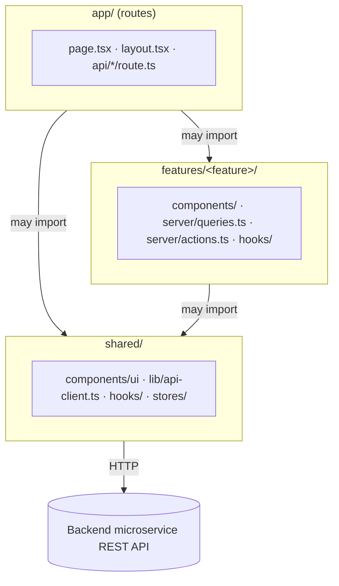
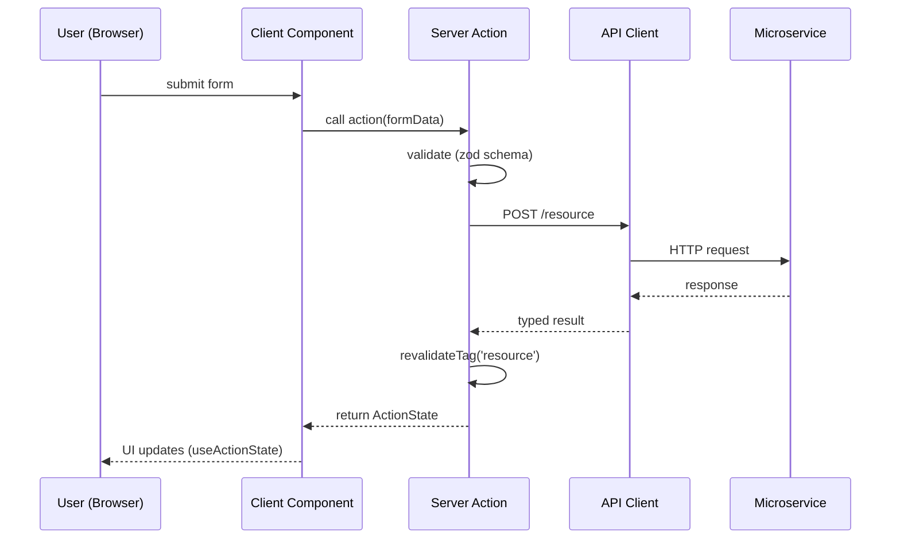

# Next.js Application Architecture

Reference architecture for `web-app` (Next.js 16, App Router, React 19). Server-first, feature-based, with an explicit client/server boundary. Matches the path aliases already declared in `tsconfig.json` (`@/features/*`, `@/hooks/*`, `@/stores/*`, `@/types/*`).

## Layers

| Layer                                        | Responsibility                                                                                                                                       | Depends on                          |
| -------------------------------------------- | ---------------------------------------------------------------------------------------------------------------------------------------------------- | ----------------------------------- |
| **Routes** (`app/`)                          | File-system routing only: compose layouts, call feature queries, pass data to components. No business logic.                                         | Features, Shared                    |
| **Features** (`features/<name>/`)            | One business capability (decks, quizzes, auth...). Owns its components, hooks, server queries/actions, types.                                        | Shared only — never another feature |
| **Server logic** (`features/<name>/server/`) | `queries.ts` (data fetching, server-only) and `actions.ts` (`'use server'` mutations). Never imported by client components directly across features. | Shared `lib/api-client`             |
| **Shared** (`shared/`)                       | Design system (`components/ui`), cross-feature hooks, zustand stores, the API client, utils. No feature-specific logic.                              | Nothing internal                    |
| **Route Handlers** (`app/api/*/route.ts`)    | Only for things Server Actions can't do: webhooks, OAuth callbacks, third-party integrations.                                                        | Shared `lib/api-client`             |

**Rule:** Server Components fetch and render; Client Components (`'use client'`) are leaf nodes for interactivity only. A feature never imports from another feature — shared code moves to `shared/`, cross-feature composition happens in `app/`.

## Folder Structure

```
src/
├── app/                              # routes only — Server Components by default
│   ├── (public)/                     # route group: marketing pages
│   │   ├── layout.tsx
│   │   └── page.tsx
│   ├── (dashboard)/                  # route group: authenticated app
│   │   ├── decks/
│   │   │   ├── page.tsx              # Server Component, calls features/decks/server/queries
│   │   │   └── [deckId]/page.tsx
│   │   └── layout.tsx
│   ├── api/
│   │   └── webhooks/stripe/route.ts  # Route Handler (webhook only)
│   └── layout.tsx                    # root layout
├── features/
│   └── decks/
│       ├── components/               # feature-local Client Components
│       │   └── deck-card.tsx
│       ├── server/
│       │   ├── queries.ts            # server-only data fetchers
│       │   └── actions.ts            # 'use server' mutations
│       ├── hooks/
│       │   └── use-deck-filters.ts
│       ├── types.ts
│       └── index.ts                  # public API of the feature (barrel)
├── shared/
│   ├── components/
│   │   ├── ui/                       # design system: button, card, input...
│   │   └── layout/                   # header, footer, shells
│   ├── lib/
│   │   ├── api-client.ts             # typed fetch wrapper per microservice
│   │   └── utils.ts
│   ├── hooks/
│   ├── stores/                       # zustand client state
│   └── types/
└── styles/
```

## Diagrams

Source files (editable, render with [Mermaid Live](https://mermaid.live) or the GitHub preview below):

- [`diagrams/nextjs-architecture-overview.mmd`](diagrams/nextjs-architecture-overview.mmd)
- [`diagrams/nextjs-mutation-flow.mmd`](diagrams/nextjs-mutation-flow.mmd)

### Module dependency map — who is allowed to import whom



This is a static rule, not a request trace — `features/<a>` has no arrow to `features/<b>` because that import is forbidden. For what actually happens at request time, see the sequence below.

### Mutation flow (form submit → Server Action → revalidate)



## Examples

### 1. Route — Server Component (`app/(dashboard)/decks/page.tsx`)

```tsx
import { getDecks } from '@/features/decks/server/queries';
import { DeckList } from '@/features/decks';

export default async function DecksPage() {
  const decks = await getDecks();
  return <DeckList decks={decks} />;
}
```

### 2. Server-only query (`features/decks/server/queries.ts`)

```ts
import 'server-only';
import { apiClient } from '@/lib/api-client';
import type { Deck } from '@/features/decks/types';

export async function getDecks(): Promise<Deck[]> {
  return apiClient.get<Deck[]>('/decks', {
    next: { tags: ['decks'] },
  });
}
```

### 3. Server Action (`features/decks/server/actions.ts`)

```ts
'use server';

import { revalidateTag } from 'next/cache';
import { z } from 'zod';
import { apiClient } from '@/lib/api-client';

const createDeckSchema = z.object({
  title: z.string().min(2).max(120),
});

export async function createDeck(formData: FormData) {
  const parsed = createDeckSchema.parse({
    title: formData.get('title'),
  });

  await apiClient.post('/decks', parsed);
  revalidateTag('decks');
}
```

### 4. Client Component — leaf interactivity (`features/decks/components/deck-card.tsx`)

```tsx
'use client';

import { useActionState } from 'react';
import { createDeck } from '@/features/decks/server/actions';
import { Button } from '@/ui/button';
import { Input } from '@/ui/input';

export function CreateDeckForm() {
  const [, formAction, isPending] = useActionState(
    async (_state: null, formData: FormData) => {
      await createDeck(formData);
      return null;
    },
    null
  );

  return (
    <form action={formAction} className='flex gap-2'>
      <Input name='title' placeholder='Deck title' required />
      <Button type='submit' disabled={isPending}>
        Create
      </Button>
    </form>
  );
}
```

### 5. Shared API client (`shared/lib/api-client.ts`)

```ts
import 'server-only';

const BASE_URL = process.env.QUESTION_SERVICE_URL;

async function request<T>(path: string, init?: RequestInit): Promise<T> {
  const res = await fetch(`${BASE_URL}${path}`, init);
  if (!res.ok) throw new Error(`API error ${res.status}: ${path}`);
  return res.json();
}

export const apiClient = {
  get: <T>(path: string, init?: RequestInit) => request<T>(path, init),
  post: <T>(path: string, body: unknown) =>
    request<T>(path, {
      method: 'POST',
      headers: { 'Content-Type': 'application/json' },
      body: JSON.stringify(body),
    }),
};
```

### 6. Feature public API (`features/decks/index.ts`)

```ts
export { DeckList } from './components/deck-list';
export { CreateDeckForm } from './components/deck-card';
export type { Deck } from './types';
```

## Conventions

- **Server-first**: default to Server Components; add `'use client'` only where interactivity, browser APIs, or hooks (`useState`, `useActionState`) are needed.
- **Feature isolation**: `features/<a>` never imports from `features/<b>`. Shared logic moves to `shared/`; cross-feature composition happens in `app/`.
- **Mutations via Server Actions**: forms call `'use server'` actions, not client-side `fetch` + manual state, unless calling a third-party/cross-origin API that requires browser-side token handling.
- **One validation schema**: the `zod` schema in the Server Action is the single source of truth — reuse it client-side with `@hookform/resolvers/zod` instead of duplicating rules.
- **Tag-based revalidation**: prefer `revalidateTag` over `revalidatePath` for granular cache invalidation.
- **Client state vs. server state**: ephemeral UI/client state → `zustand` (`shared/stores`); server data → Server Component fetch + `revalidateTag`, with `@tanstack/react-query` reserved for cases needing client-side polling/optimistic updates beyond what Server Actions give you.
- **Start simple**: a feature with one page and no mutation can skip `server/actions.ts` entirely — add layers when the feature actually needs them.

Sources:

- [Next.js 16 App Router Project Structure: The Definitive Guide](https://makerkit.dev/blog/tutorials/nextjs-app-router-project-structure)
- [The Ultimate Next.js App Router Architecture — Feature-Sliced Design](https://feature-sliced.design/blog/nextjs-app-router-guide)
- [Next.js Architecture in 2026: Server-First, Client-Islands](https://www.yogijs.tech/blog/nextjs-project-architecture-app-router)
- [How to Build Reusable Architecture for Large Next.js Applications](https://www.freecodecamp.org/news/reusable-architecture-for-large-nextjs-applications/)
- [Getting Started: Server and Client Components — Next.js Docs](https://nextjs.org/docs/app/getting-started/server-and-client-components)
