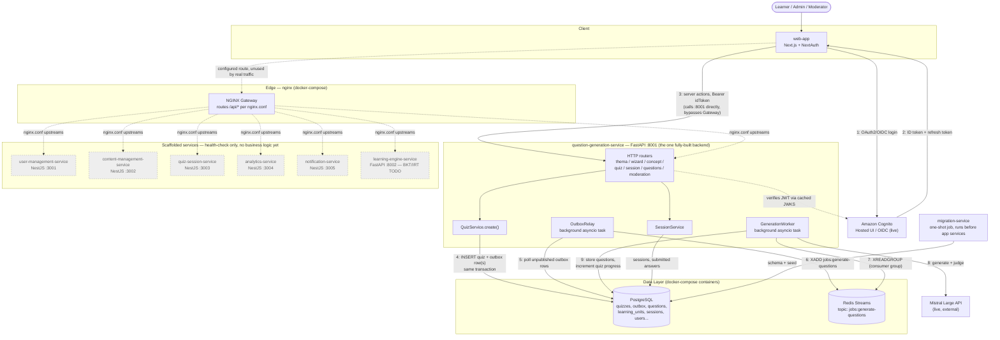
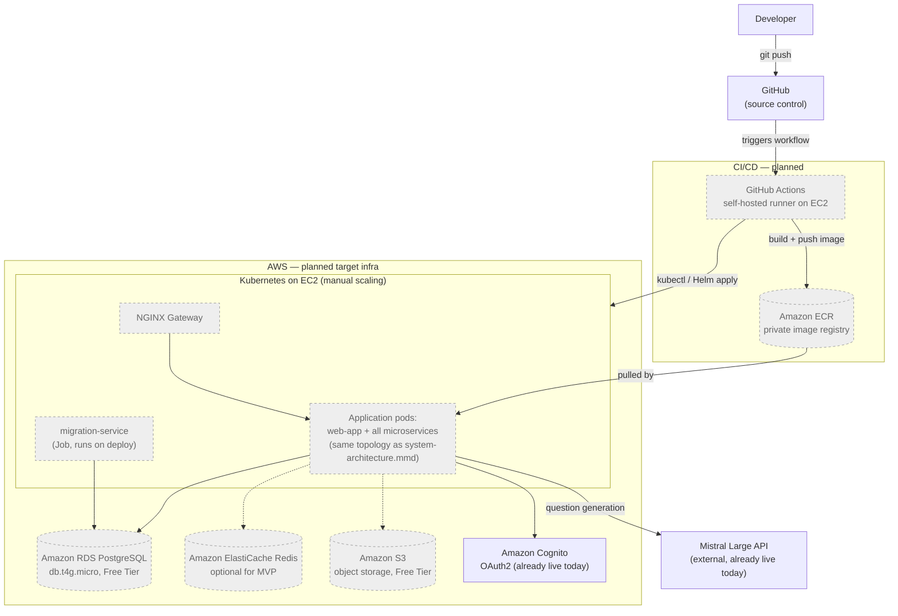

# Memosphere Architecture Diagrams

Two diagrams, kept deliberately separate so "what's real" is never mixed with "what's planned":

1. **[System architecture](#1-system-architecture-current-state)** — what the code actually does today.
2. **[Deployment target](#2-deployment-target-planned)** — the AWS topology described in [infra-architecture.md](../architecture/infra-architecture.md), not yet provisioned.

## 1. System architecture (current state)

Source: [`system-architecture.mmd`](system-architecture.mmd)

Only **question-generation-service** (FastAPI) is fully built — it owns thema extraction, the
wizard, quiz creation, quiz sessions/answers, question generation, and moderation. Everything a
learner does today flows through it. Six other services (`user-management`, `content-management`,
`quiz-session`, `analytics`, `notification`, `learning-engine`) exist in `docker-compose.yml` and
`nginx.conf` but only expose a `/health` stub — shown dashed/grey below. The `nginx` gateway is
running and correctly configured for all seven services, but `web-app` currently calls
question-generation-service directly (via `NEXT_PUBLIC_QUESTION_GEN_URL`), so the gateway sits
unused on the one real request path.

The most important detail is the async question-generation pipeline: `POST /v1/quizzes` writes the
quiz row and its outbox events in one Postgres transaction; a background `OutboxRelay` task
publishes those events to a Redis stream; a background `GenerationWorker` task consumes the stream,
calls Mistral, and writes the generated questions back to Postgres. Both workers run in-process
inside the question-generation-service, not as separate deployables.

## 2. Deployment target (planned)

Source: [`deployment-target.mmd`](deployment-target.mmd)

This is the AWS topology described in [infra-architecture.md](../architecture/infra-architecture.md)
(Kubernetes on EC2, RDS, ElastiCache, S3, ECR, self-hosted Actions runner). None of it is
provisioned — there's no Terraform/IaC or k8s manifests in the repo, and
[`.github/workflows/ci.yml`](../../.github/workflows/ci.yml) currently only runs
lint/type-check/tests on GitHub-hosted runners. Cognito and Mistral are the two pieces of this
diagram that are already live, since the application code integrates them directly regardless of
where it's deployed.

