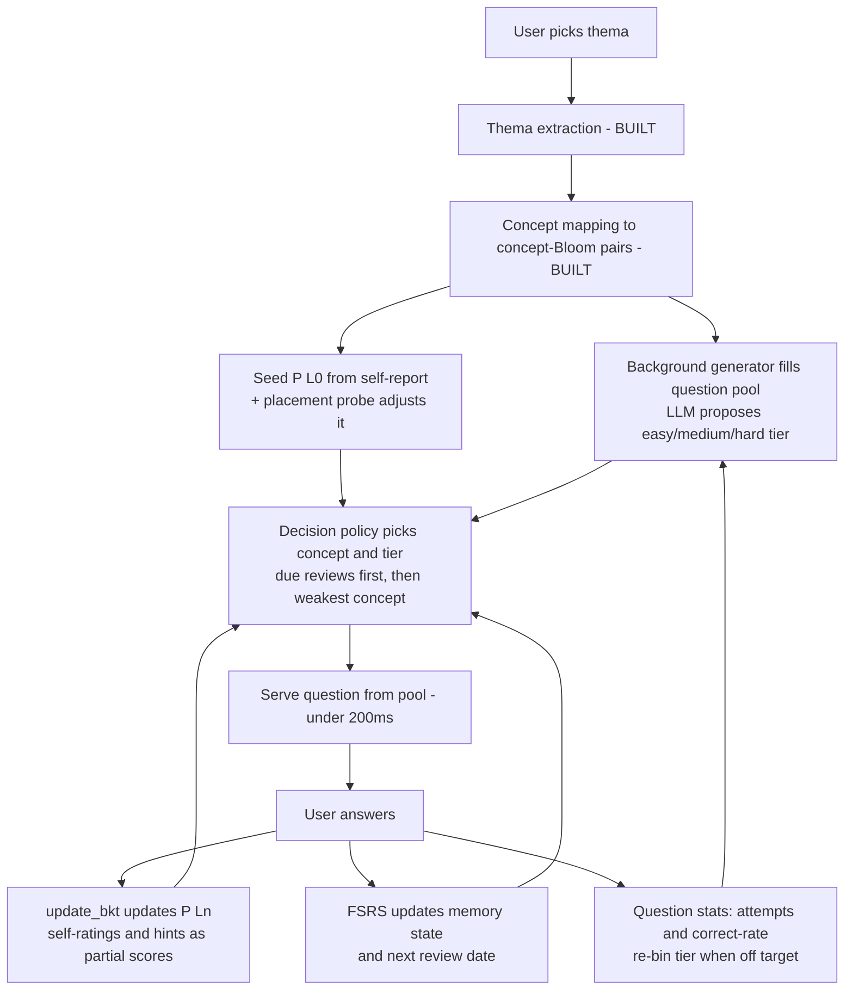

# Adaptive Engine Design Review

**Scope**: the adaptive-learning core described in `main-workflow.md`, `functional-specification.md`, `mvp.md`, and `python-functions.md`.
**Audience**: product owner (engineer, not a data scientist). Every statistical term is explained in the glossary and in context.
**Status of the codebase**: thema extraction (`/v1/thema/*`) and concept mapping (`/v1/concepts/map`) are implemented and working. Question generation is a stub. The adaptive engine (mastery tracking, decision engine, scheduling) does not exist yet — which means everything in this review is cheap to fix now.

---

## 1. Executive summary

The skeleton of the design is right and worth keeping: break a topic into small concepts, track how well the learner knows each one, pick the next question based on that, and re-test things before they are forgotten. That is exactly how good adaptive tutors work.

The problem is that the spec bolts together **four separate statistical machines** (BKT, IRT, SM-2, plus a custom decay model) that overlap, contradict each other, and in two places are mathematically broken: the mastery gate (`θ > 2.5`) is practically unreachable, and the flashcard updates corrupt the mastery numbers they feed. One machine — BKT — plus one modern review scheduler — FSRS — covers everything the four were supposed to do. Question difficulty should come from real answer data (a reusable question pool), not from numbers the LLM invents. The `<200ms` question-serving target is achievable only with that pool; it is impossible with a live LLM call.

Verdict: **keep the loop, cut the machinery in half, fix the two broken formulas, and build a question pool.** Details and a concrete v2 design follow.

---

## 2. How the current spec works (plain-language recap)

Per `main-workflow.md` Steps 4–13, a session runs like this:

1. The user names a topic ("Photosynthesis"). The AI extracts a clean **Thema/Topic** and asks how familiar the user already is (Step 5). _(Built.)_
2. The AI splits the thema into small **atomic concepts** and tags each with the **Bloom levels** it can be tested at — remembering, understanding, applying, etc. (Step 6). _(Built.)_
3. Each concept gets a starting **mastery probability P(L0)** — a number between 0 and 1 meaning "chance the user already knows this" — seeded from the self-reported familiarity (Steps 5, 7): Unseen → 0.2, Recognized → 0.4, Practiced → 0.6, Mastered → 0.8.
4. The AI generates a question on the fly for a chosen concept, stamping it with three **IRT numbers** it makes up: difficulty _b_, discrimination _a_, guess rate _c_ (Step 8). A validation checklist gates bad questions.
5. The user answers. Two trackers update: **P(Ln)** (BKT mastery, per concept) and **θ** (IRT ability score, per concept) (Steps 9–10).
6. A **decision engine** picks what comes next: reinforce if P(Ln) < 0.6, advance if P(Ln) > 0.9 _and_ θ > 2.5, remediate on repeated slips (Step 11).
7. A concept–Bloom pair is declared **mastered** when P(Ln) > 0.9, θ > 2.5, at least two Bloom levels assessed, and no recent slips (Step 13). Mastery then **decays**: after `decay_threshold_days` (default 14) it expires and gets requeued for review (Step 3).
8. Separately, flashcards ("memocards") are scheduled with the **SM-2** algorithm and their Easy/Good/Hard self-ratings directly add or subtract from P(Ln) (`functional-specification.md` §3.5, §4.3).

---

## 3. Glossary (plain language)

- **BKT — Bayesian Knowledge Tracing.** Keeps one number per concept: the probability the learner has "got it", updated after every answer. Like a coach who, after each attempt, revises their gut feeling: "correct answer on a hard-to-guess question — she probably knows this now." It also knows learners sometimes guess right (P(G)) or slip on things they know (P(S)).
- **P(Ln).** BKT's output: the current "probability of mastery" for one concept, from 0 (definitely doesn't know it) to 1 (definitely does).
- **IRT — Item Response Theory.** The statistics behind standardized tests like the SAT. Each _question_ gets calibrated numbers (how hard it is, how well it separates strong from weak students, how guessable it is), and each _person_ gets an ability score. The catch: calibrating a question honestly needs hundreds of real people answering it.
- **θ (theta).** IRT's ability score. Scaled like a bell curve centered at 0: most people sit between −1 and +1; +2.5 is roughly "top half-percent of test-takers".
- **Bloom level.** A ladder of thinking depth: remember → understand → apply → analyze → evaluate → create. "What is photosynthesis?" is rung 1; "design an experiment to measure it" is rung 5.
- **SM-2.** The 1987 flashcard-interval formula from SuperMemo: answer well → wait longer before the next review; answer badly → reset to tomorrow.
- **FSRS.** SM-2's modern successor, fit to hundreds of millions of real reviews and shipped in Anki. Its useful superpower: at any moment it can tell you the _probability you still remember_ a card — a forgetting model and a scheduler in one.
- **Elo.** The chess rating system: winner takes points from the loser, more points for an upset. Can rate questions the same way ("this question keeps beating strong learners — it's hard"). Mentioned because the spec's `update_irt()` is secretly an Elo-style update, not real IRT.

---

## 4. Issues found

### 4.1 The mastery gate θ > 2.5 is practically unreachable — **Blocker**

**What the spec says**: Advance requires "P(Ln) > 0.9 and θ > 2.5" (`main-workflow.md` Step 11); mastery declaration requires the same θ > 2.5 (Step 13). `python-functions.md` (`update_irt`) clamps θ to [−3, +3] and moves it by `learning_rate × error` per answer, with learning_rate ≈ 0.1–0.2.

**Why it's a problem**: 2.5 on this scale means "top ~0.6% of test-takers". Worse, do the arithmetic on the spec's own update rule: for a question matched to the learner's level, a correct answer moves θ up by only about 0.04–0.08. Getting from 0 to 2.5 takes roughly **30–60 consecutive correct answers per concept**, and every miss pushes it back down. And θ is tracked _per concept_, so this grind repeats for every concept. Nobody will ever see "Advance" or "Mastered" — and since climbing the Bloom ladder happens only through "Advance", learners are also pinned to their starting Bloom level or below.

**What to do**: drop the θ gate entirely. Gate advancement and mastery on P(Ln) alone (concrete bands in §5.4).

### 4.2 BKT and per-concept IRT are redundant — **Major**

**What the spec says**: Steps 9–10 update both P(Ln) (BKT) and θ (IRT) per concept after every answer; Step 11 consults both.

**Why it's a problem**: both numbers answer the same question — "how well does this learner know this concept?" — from the same evidence stream. Running two gauges on one fuel tank doubles code, doubles tuning, and creates contradictions (θ says no while P(Ln) says yes, per issue 4.1). Real IRT earns its keep when you have _calibrated_ questions and want one ability score across a whole test; neither applies here. Confirming the redundancy: the spec's `update_irt()` isn't IRT estimation at all — it's a simple nudge-up/nudge-down rule (an Elo-style gradient step), so the design is already paying IRT's complexity price without getting IRT.

**What to do**: keep BKT as the single learner model. Drop per-learner θ.

### 4.3 LLM-invented IRT item parameters are fiction — **Major**

**What the spec says**: Step 8 has the LLM stamp each generated question with difficulty _b_, discrimination _a_, and guess rate _c_; Step 11 and the review fallback (Step 3C) then select items by comparing _b_ to θ ("easier item (b < θ)").

**Why it's a problem**: those three numbers only mean something when estimated from hundreds of real answers per question — that's what "calibration" is. An LLM assigning `b = 1.2` is a guess dressed as measurement, and the decision engine then makes real decisions by comparing that guess to θ (which is itself broken, per 4.1). It compounds: generation is driven by the _individual_ learner's current P(Ln) and θ (Step 8 inputs), and reviews trigger fresh generation too (Step 11: "Generate a new question using Prompt 4"), so questions are effectively personalized one-offs — a `question_bank` table exists, but nothing in the design routes many learners through the _same_ question. Without that, no question ever collects enough answers to correct the guess. The guesses stay guesses forever.

**What to do**: replace `a/b/c` with a single coarse difficulty tier (easy / medium / hard) that the LLM proposes at generation time, then **correct it with data**: pool questions, reuse them across learners, track each question's observed correct-rate, and re-bin (details §5.3). Guess-rate doesn't need a parameter — it's known from the format (4-option MCQ ≈ 25%, true/false ≈ 50%) and already lives inside BKT's P(G).

### 4.4 No rule for the zone where most learners sit (P(Ln) 0.6–0.9) — **Major**

**What the spec says**: Step 11: Reinforce if P(Ln) < 0.6; Advance if P(Ln) > 0.9 (and θ > 2.5); Remediate on repeated slips. Nothing else.

**Why it's a problem**: a learner making normal progress spends most of a session between 0.6 and 0.9 — that's precisely what "learning" looks like in BKT. In that band, with no slips, the engine has no defined action. The most common state of the system is unspecified behavior.

**What to do**: three exhaustive bands covering [0, 1] with no gaps — see §5.4.

### 4.5 Flashcard self-ratings corrupt the mastery numbers — **Major**

**What the spec says**: `functional-specification.md` §3.5: Easy → P(Ln) += 0.15, Good → +0.10, Hard → +0.05, Again → −0.05; hints halve the learning gain; extra audio replays apply "a slight P(Ln) penalty".

**Why it's a problem**: P(Ln) is a _probability computed by a formula_ (`update_bkt()` in `python-functions.md`, which is correct). Its guarantees — stays in [0,1], moves proportionally to how surprising the evidence was — come from that formula. Adding flat +0.15 bonuses on top is like adjusting a thermometer with a screwdriver because the room feels warm: the number still displays, but it no longer measures anything trustworthy. Ten "Easy" taps on trivial cards would certify mastery of a concept never actually tested. It also creates a perverse incentive: users learn that tapping "Easy" levels them up.

**What to do**: feed self-ratings _through_ the existing Bayesian update, not around it: map Again/Hard/Good/Easy to a response score (0 / 0.4 / 0.8 / 1.0) and call `update_bkt()` — it already accepts partial scores. Hints likewise: score a hint-assisted correct answer as 0.5 and let the formula do its job. Delete the replay penalty (replaying audio is engagement, not evidence of not-knowing).

### 4.6 Three overlapping forgetting models — **Major**

**What the spec says**: (1) SM-2 intervals for memocards (`functional-specification.md` §4.3); (2) an `apply_decay()` that erodes P(Ln) after a fixed `decay_threshold_days` (default 14) with `decay_status` flags in `mastery_log` (`main-workflow.md` Steps 3, 13); (3) "Extend BKT to model forgetting" (Step 13) — a third, unspecified mechanism.

**Why it's a problem**: three clocks, none agreeing, all answering one question: "when should this learner see this again?" A concept could be simultaneously 'Active' in mastery_log, overdue in SM-2, and freshly decayed by apply_decay. Each needs code, tables, cron jobs, and debugging. And the fixed 14-day threshold treats a concept reviewed five times the same as one reviewed once, which is the opposite of how memory works (each successful review roughly multiplies how long you retain something).

**What to do**: **one scheduler for everything — FSRS** (available as a small, permissively-licensed Python library, e.g. `py-fsrs`, with sensible default parameters). Every concept and every memocard gets an FSRS memory state; FSRS outputs both the next review date _and_ the current probability-of-recall, which replaces `apply_decay()` and the `decay_status` machinery outright. _Alternative considered_: keep SM-2 — it's simpler on paper and already spec'd. Rejected because the spec needs a decay _signal_ (current recall probability) as well as intervals, and SM-2 doesn't provide one — that's exactly the gap the second and third forgetting models were invented to fill. FSRS via a library is comparable integration effort and makes the other two models deletable. This is a consolidation, not gold-plating.

### 4.7 The <200ms generation SLA is impossible with live LLM calls — **Major**

**What the spec says**: `functional-specification.md` §8.1: "Question generation (text-only): <200ms". Steps 8 and 11 generate each question with an LLM call at serve time.

**Why it's a problem**: a Mistral Large completion takes on the order of 1–10 seconds. No amount of optimization gets a live LLM round-trip under 200ms. Either the SLA dies or the architecture changes.

**What to do**: a **question pool** (the spec already has the table: `question_bank`). At session start, kick off background generation of a batch per concept–Bloom pair; _serve_ questions from the pool with a simple indexed query (that's where <200ms is trivially met); top the pool up in the background while the user answers. First-question latency is masked by the session-init screen (§8.1 already allows 2s there). Bonus: pooled questions are _reused across learners_, which is what makes issue 4.3's data-driven difficulty correction possible. Same economics as the spec's own multimedia rule ("generate assets once, reuse across users", §5.2).

### 4.8 Learning-styles claims oversell — **Minor**

**What the spec says**: §6.1 infers Visual/Auditory/Kinesthetic/Reading learner types after 50 questions and adapts content to match, and Step 13 tells users "You learn best with visual diagrams."

**Why it's a problem**: the "meshing" idea — match teaching format to a person's style and they learn _more_ — has been tested many times and research consistently fails to support it. What does hold up: some _content_ is inherently visual, and people _enjoy_ formats they prefer (engagement, retention of the user — not of the memory). Selling preference-adaptation as a learning gain invites justified criticism.

**What to do**: keep the mechanism, fix the framing. Adapt formats to _content type_ (spec already does: vocabulary → audio, processes → sequencing) and to _engagement_ ("you seem to enjoy image questions"), and never claim "you learn best with X". Deprioritize the learner-type classifier itself.

### 4.9 `docs/ai/ai-usage.md` describes an abandoned architecture — **Minor**

**What the spec says**: fine-tune BERT, Hugging Face pipelines, incremental training with Elastic Weight Consolidation.

**Why it's a problem**: the actual system (per `mvp.md` and the implemented `clients/mistral_client.py`) calls the Mistral API. BERT isn't a generative model in this sense anyway — the doc is a stale brainstorm that will mislead any new contributor.

**What to do**: move it to `docs/archive/` with a one-line header pointing at `mvp.md`.

### 4.10 Cold start via self-report is workable but weak — **Minor**

**What the spec says**: Step 5 seeds P(L0) from a single self-reported exposure level for the whole thema (0.2 / 0.4 / 0.6 / 0.8).

**Why it's a problem**: people misjudge their own knowledge in both directions, and one number for the whole thema can't capture "knows the vocabulary, never understood the mechanism". A wrong P(L0) costs a few wasted questions before BKT self-corrects — annoying, not fatal.

**What to do**: keep self-report for day one (BKT genuinely self-corrects within ~3–5 answers). Fast-follow: a **placement probe** — the first 2–3 questions of any new thema are drawn at mixed difficulty and used to adjust P(L0) across its concepts before the adaptive loop takes over. Cost: zero extra UI, three questions the user was going to answer anyway.

---

## 5. Recommended architecture ("v2")

One learner model, one scheduler, one pool, one decision policy.

**5.1 Mastery model — BKT only.** One P(Ln) per concept–Bloom pair, updated exclusively by `update_bkt()` (already written and correct). All evidence — MCQ answers, flashcard self-ratings, hint-assisted answers — enters as a response score between 0 and 1 through that one function. Delete per-learner θ, `update_irt`, and every direct `P(Ln) +=`. _Alternative considered_: BKT + Elo ratings for learners and items. Elo is genuinely simple, but a second learner-side number reintroduces the two-gauges problem for a team without a data scientist to arbitrate disagreements. Not needed at MVP scale; revisit only if difficulty binning (5.2) proves too coarse.

**5.2 Difficulty model — three tiers, corrected by data.** Each pooled question carries `difficulty_tier ∈ {easy, medium, hard}` (LLM-proposed) plus two counters: `attempts` and `correct_count`. After a question has 20+ attempts, re-bin it by observed correct-rate: >80% → easy, 40–80% → medium, <40% → hard. The LLM's guess is a starting point, never a verdict. Keep `question_bank` and `question_validation_log`; drop columns `difficulty_b`, `discrimination_a`, `guessing_c`.

**5.3 Question pool.** Serve-time is a DB read; generation is a background worker (Redis queue — infrastructure the spec already plans for multimedia in §5.1). Pool floor: ≥5 validated questions per active concept–Bloom–tier; top up when a learner is 2 questions from draining a bucket. Questions are shared across all learners studying the same concept.

**5.4 Decision policy — exhaustive bands, no gaps.** In priority order:

1. **Review due** (FSRS says recall probability < 90%): serve a review question for that concept. Highest priority — forgetting is the expensive failure.
2. **P(Ln) < 0.40 → Remediate**: same concept, one Bloom level down (or easier tier at Bloom 1), scaffolded hints free.
3. **0.40 ≤ P(Ln) ≤ 0.85 → Practice**: same concept–Bloom, tier matched to P(Ln) (< 0.6 easy, otherwise medium). This is the band the current spec forgot.
4. **P(Ln) > 0.85 → Advance**: next Bloom level, or next weakest concept if the Bloom ladder for this concept is done.
5. **Mastered**: P(Ln) ≥ 0.95 _and_ the last 3 answers on this pair correct without hints. Log to `mastery_log`; from then on the pair lives on the FSRS review calendar only.

**5.5 Scheduler and forgetting — FSRS for everything.** Every concept–Bloom pair and every memocard has one FSRS memory state (a few floats). Correct/incorrect answers and Again/Hard/Good/Easy ratings map directly onto FSRS's four-grade input. FSRS's predicted recall probability is the _only_ decay signal: it drives review priority (5.4 rule 1) and dashboard "fading" indicators. Delete: SM-2 fields, `apply_decay()`, `decay_status`, `decay_threshold_days`, and the "extend BKT for forgetting" idea.

**5.6 Cold start.** Self-reported exposure sets P(L0) as today (Step 5 — keep). Placement probe: first 3 questions of a new thema at easy/medium/hard; each answer nudges P(L0) of related concepts (±0.1) before normal BKT takes over.

**5.7 What stays from the current spec, unchanged.** Concept–Bloom decomposition (Steps 5–6), `update_bkt()` as written, the validation gate (Step 7A), question feedback/flagging, session analytics, RBAC, content-type-driven format selection.

---

## 6. Build order (mapped to what exists)

**Phase 0 — paper fixes (days).** Update `main-workflow.md` and `functional-specification.md` per this review; archive `ai-usage.md`; migrate schema (drop a/b/c and decay columns, add tier + counters + FSRS state).

**Phase 1 — question generation into a pool (next; unblocks everything).** Prompt 3 + validation gate + `question_bank` writes + background worker. Builds directly on the finished thema/concept endpoints; `questions_router.py` is the stub waiting for it.

**Phase 2 — the loop, minimal.** Serve-from-pool endpoint; answer submission; `update_bkt()` wiring; decision bands from 5.4 (rules 2–4). No reviews yet. This is a demoable adaptive product.

**Phase 3 — memory.** FSRS integration (library), review queue driven by recall probability, mastery declaration (rule 5), memocards riding the same scheduler.

**Phase 4 — refinement.** Difficulty re-binning job, placement probe, engagement-based format adaptation, analytics dashboards.

---

## 7. What NOT to build (or defer)

- **Per-learner θ / `update_irt()`** — cut; redundant with BKT and gated the system shut (4.1, 4.2).
- **LLM-assigned a/b/c parameters** — cut; fiction until calibrated, and never calibrated here (4.3).
- **`apply_decay()` + decay-status machinery + SM-2** — cut; FSRS replaces all three (4.6).
- **Learner-type classifier (VAK)** — defer indefinitely; adapt to content and engagement instead (4.8).
- **Fresh question per learner per turn** — cut; pool and reuse (4.7).
- **Vector DB, concept battles, leaderboards, AR/VR memory palaces** — defer; none touch the core loop the MVP must validate.
- **Fine-tuning any model (BERT plan)** — cut; the Mistral API architecture is the real one (4.9).

---

## Verification notes

Numbers checked against source: θ clamp [−3, +3] and update step (`python-functions.md`, `update_irt`); θ > 2.5 gates (`main-workflow.md` Steps 11, 13); P(Ln) bands 0.6/0.9 (Step 11; `functional-specification.md` §3.6); flashcard +0.15/+0.10/+0.05/−0.05 and 50% hint penalty (§3.5); SM-2 spec (§4.3); 14-day decay default (`db-schema.md`, `mastery_log`); <200ms SLA (§8.1); P(L0) seeds (Step 5). The estimate "30–60 consecutive correct answers to reach θ = 2.5" follows from the spec's own update rule: per-answer gain ≈ learning_rate (0.1–0.2) × error (≈ 0.3–0.4 for a level-matched item) ≈ 0.04–0.08 per correct answer.
